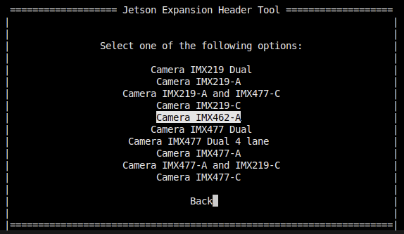
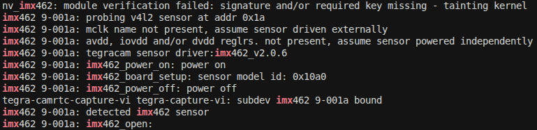

# imx462 MIPI NVIDIA driver

Tested with NVIDIA Jetson Linux 36.4.4 (JetPack 6.2.1).

## Quickstart

Prebuilt driver files are provided in [./prebuilt](./prebuilt) directory for quick setup. If you wish to build from source, see [Build from source](#build-from-source).

To get imx462 running on your Jetson device using prebuilt files:

---

Connect camera to `cam0` port.

> [!NOTE]
> Currently, only `cam0` port support is implemented.

---

Clone the repository to your Jetson machine and navigate to the cloned directory:

```bash
cd ~
git clone https://github.com/Kurokesu/imx462-mipi-nvidia.git
cd imx462-mipi-nvidia/
```

---

Run setup script:

```bash
sudo ./setup.sh
```

---

Use the Jetson-IO tool to configure the 24-pin CSI connector:

```bash
sudo /opt/nvidia/jetson-io/jetson-io.py
```

Navigate through the menu:
1. Configure Jetson 24pin CSI Connector
2. Configure for compatible hardware
3. Select Camera IMX462-A



4. Save pin changes
5. Save and reboot to reconfigure pins

---

After reboot verify that the sensor is detected over I2C:

```bash
sudo dmesg | grep imx462
```



## Image output

### GStreamer

```bash
gst-launch-1.0 -e nvarguscamerasrc sensor-id=0 ! \
   'video/x-raw(memory:NVMM),width=1920,height=1080,framerate=30/1' ! \
   queue ! nvvidconv ! queue ! nveglglessink
```

### NVIDIA sample camera capture application

```bash
nvgstcapture-1.0 --sensor-id 0
```

### Raw v4l2

Stream raw data to file:

```bash
v4l2-ctl -d /dev/video0 --set-fmt-video=width=1920,height=1080,pixelformat=RG10 --stream-mmap --stream-to imx462_1080p.raw --stream-count=1 --stream-skip=10 --verbose
```

View raw bayer file:

```bash
python3 view_raw.py ./imx462_1080p.raw
```

## Test mode

The sensor has a built-in test pattern generator that can be used to verify data validity.

After running `sudo ./setup.sh` the driver is installed and loaded automatically at boot.  
The `test_mode` module parameter can then be controlled at runtime via sysfs:

```bash
# Horizontal color‑bar chart example (test_mode = 2)
echo 2 | sudo tee /sys/module/nv_imx462/parameters/test_mode
```

To turn the test pattern off:

```bash
echo 0 | sudo tee /sys/module/nv_imx462/parameters/test_mode
```

| Test pattern code | Description |
| ------------ | ----------- |
| 0 | Off |
| 1 | Sequence Pattern 1 |
| 2 | Horizontal Color-bar Chart |
| 3 | Vertical Color-bar Chart |
| 4 | Sequence Pattern 2 |
| 5 | Gradation Pattern 1 |
| 6 | Gradation Pattern 2 |
| 7 | 000h/555h Toggle Pattern |

## Build from source

Currently the driver is built directly in the kernel sources as acquiring NVIDIA Linux headers hasn't been implemented yet. Best to use host PC, because whole kernel has to be built initially. Full NVIDIA kernel customization guide can be found [here](https://docs.nvidia.com/jetson/archives/r36.4.4/DeveloperGuide/SD/Kernel/KernelCustomization.html).

> [!IMPORTANT]
> The following instructions should be executed on the host PC.

### Prerequisites

git:

```bash
sudo apt install git
```

Linux kernel build utilities:

```bash
sudo apt install build-essential bc flex bison libssl-dev zstd
```

Download the Bootlin toolchain binaries:

```bash
cd ~/Downloads
wget https://developer.nvidia.com/downloads/embedded/l4t/r36_release_v3.0/toolchain/aarch64--glibc--stable-2022.08-1.tar.bz2
```

Extract the toolchain:

```bash
mkdir ~/l4t-gcc
cd ~/l4t-gcc
tar xf ~/Downloads/aarch64--glibc--stable-2022.08-1.tar.bz2
```

Download Linux for Tegra kernel source:

```bash
cd ~/Downloads
wget https://developer.download.nvidia.com/embedded/L4T/r36_Release_v4.4/release/Jetson_Linux_R36.4.4_aarch64.tbz2
```

Extract:

```bash
cd ~
tar xf ~/Downloads/Jetson_Linux_R36.4.4_aarch64.tbz2 
```

Sync the Kernel Sources with Git:

```bash
cd Linux_for_Tegra/source/
./source_sync.sh -k -t jetson_36.4.4
```

Export build variables:

```bash
export CROSS_COMPILE=$HOME/l4t-gcc/aarch64--glibc--stable-2022.08-1/bin/aarch64-buildroot-linux-gnu-
export KERNEL_HEADERS=$HOME/Linux_for_Tegra/source/kernel/kernel-jammy-src
```

Build the kernel:

```bash
make -C kernel
```

Build the NVIDIA Out-of-Tree modules:

```bash
make modules
```

Build the DTBs:

```bash
make dtbs
```

Now that the default kernel build is ready, you can clone imx462 driver repo:

```bash
cd ~
git clone https://github.com/Kurokesu/imx462-mipi-nvidia.git
cd imx462-mipi-nvidia/
```

Build using the `build.sh` script:

```bash
./build.sh
```

Upon a successful build, the kernel files will be placed in the `./build` directory. They can then be loaded onto the target.
